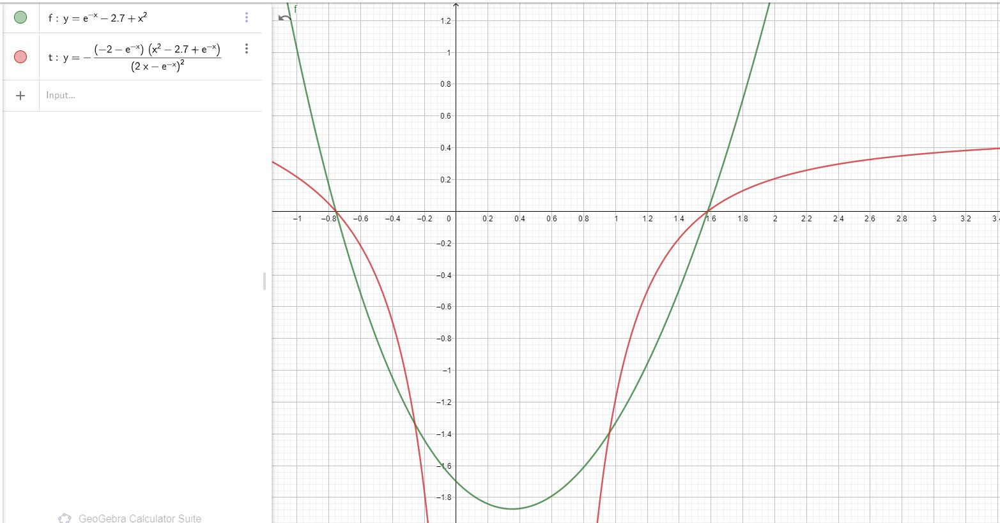
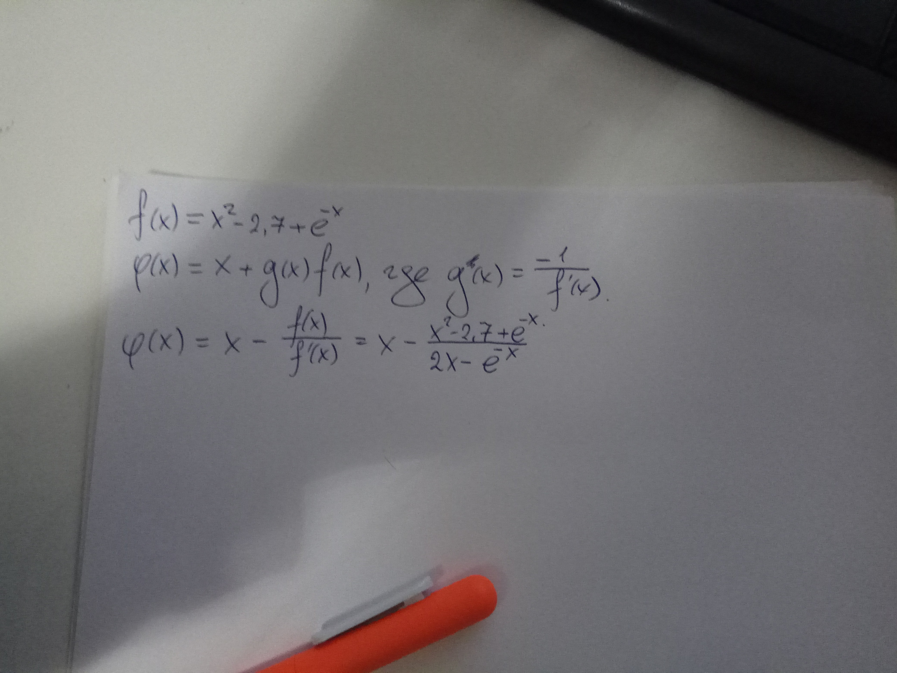

# Лабораторная №2
Вариант №17

## Результаты

```bash

Метод половинного деления: 
Ответ между [1.579193115234375, 1.5791976928710938] 
1.5791954040527343

Метод Ньютона: 1.579195737423918

Модифицированный метод Ньютона: 1.5791958513245379

Метод Хорд: 1.5791956527178894

Метод подвижных хорд: 1.5791957374280592

Метод простых итераций: 1.579195737423918

Количество итераций:
Простые итерации: 3
Ньютон: 4
Движущиеся хорды: 5
Хорды: 6
Модифицированный Ньютон: 7
Половинное деление: 17
```

Из этих выкладок видно, что лучше всего работает метод простых итераций, а хуже всего - метод половинного деления

## Обоснования

### Выбор конца отрезка
Выбор нужного конца отрезка основывается на формуле: f(x)*f''(x) > 0. 
Если это выполняется, то выбирается этот конец отрезка. 

### Выбор функции фи и отрезков

Из графиков функций видно, что лучше всего выбрать отрезок [1.2; 1.8], так как при нём
производная функции фи по модулю меньше единицы






# Лабораторная №3

```bash
Метод Гаусса:
List(1.9999999999999858, 3.000000000000023, 0.9999999999999972)

Метод Гаусса с выбором главного элемента: 
List(1.9999999999999998, 3.0, 1.0)

Метод Якоби:
Количество интерация метода Якоби: 26
Vector(1.9999764031848297, 3.0000471665063273, 0.9999926750518577)

Метод Гаусса-Зейделя
Количество интерация метода Гаусса-Зейделя: 12
Vector(2.000020209728186, 2.999983302234075, 1.0000023627814556)
```

Сразу заметим, что количество итераций для нахождения корней в методе Гаусса-Зейделя более чем в два раза меньше. 

Сравнивая два метода Гаусса и метод Гаусса с выбором главного элемента заметим, что метод с выбором главного элемента даёт более точный резаультат.

Для сходимости методв Якоби и Гаусса-Зейделя достаточно поменять местами строки в матрице, чтобы матрицы стали обладать свойством строгого диагонального преобладания. 
Матрица будет выглядить так: 
```bash
0.83   0.34  -0.1   2.58
-0.37  -0.5  -0.13  -2.37
-0.03  0.2   1.67   2.21
```
